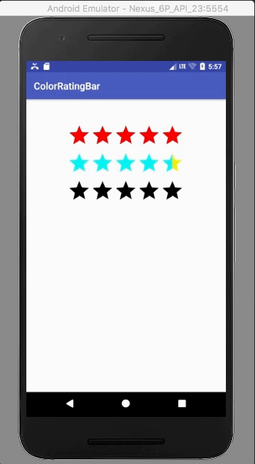

# ColorRatingBar

## Introduction
Change Star Color of Rating Bar(min SDK: 14)


#### * An example project / library of ColorRatingBar



## Usages

Add your buildscript
#### • maven
```xml
<dependency>
  <groupId>hyogeun.github.com.colorratingbar</groupId>
  <artifactId>ColorRatingBar</artifactId>
  <version>1.0.0</version>
  <type>pom</type>
</dependency>
```
#### • gradle
```java
compile 'hyogeun.github.com.colorratingbar:ColorRatingBar:1.0.0'
```


### Eexample
#### 1. xml
```xml
<hyogeun.github.com.colorratingbarlib.ColorRatingBar
        android:id="@+id/rating_1"
        android:layout_width="wrap_content"
        android:layout_height="wrap_content"
        android:rating="3"
        app:empty_color="#f0f000"
        app:progress_color="#00f0f0" />
```

#### 2. Code
  ##### 1) Activity
  ```java
  ColorRatingBar colorRatingBar = new ColorRatingBar(this);
  colorRatingBar.setRatingProgressColor(R.color.colorPrimary);
  colorRatingBar.setRatingEmptyColor(R.color.colorAccent);
  colorRatingBar.setRating(3.0f);
  ```
  ##### 2) Fragment
  ```java
  ColorRatingBar colorRatingBar = new ColorRatingBar(getContext());
  colorRatingBar.setRatingProgressColor(R.color.colorPrimary);
  colorRatingBar.setRatingEmptyColor(R.color.colorAccent);
  colorRatingBar.setRating(3.0f);
  ```
